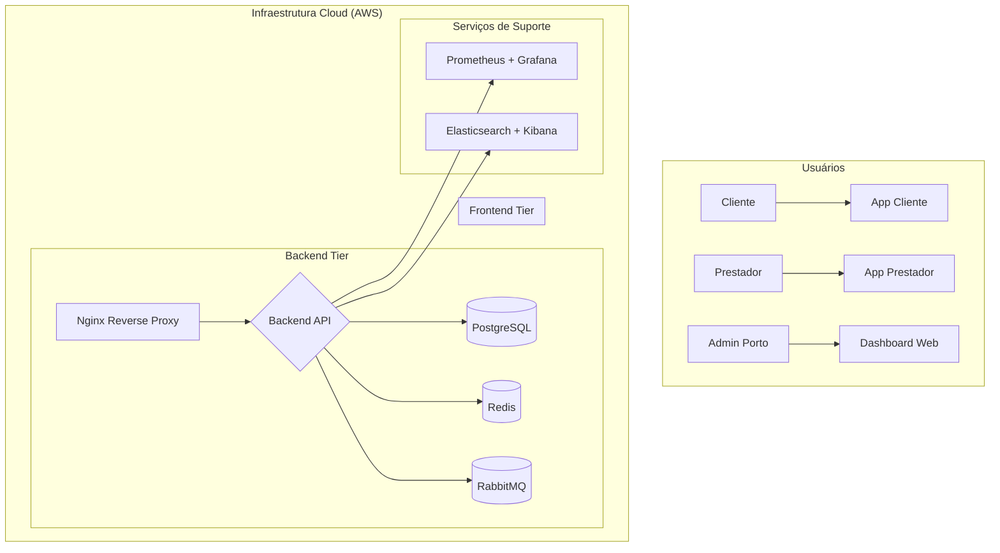

# Documentação Técnica - Facilita+ Porto Seguro Edition

**Autor:** Manus AI
**Data:** 07 de Outubro de 2025
**Versão:** 1.0.0

## 1. Visão Geral

Este documento detalha a arquitetura técnica e as decisões de implementação da plataforma **Facilita+ Porto Seguro Edition**, uma solução completa para gestão de serviços patrimoniais, conectando clientes, prestadores e a Porto Seguro em um ecossistema digital integrado.

A plataforma foi desenvolvida com foco em **escalabilidade, segurança, performance e manutenibilidade**, utilizando um stack tecnológico moderno e práticas de desenvolvimento enterprise.

## 2. Arquitetura da Solução

A plataforma segue uma arquitetura de micro-serviços orquestrada com Docker Compose, composta pelos seguintes componentes principais:

| Componente          | Tecnologia                 | Responsabilidade                                    |
|---------------------|----------------------------|-----------------------------------------------------|
| **Backend API**     | NestJS (Node.js)           | Lógica de negócio, autenticação, APIs REST/GraphQL  |
| **Frontend Web**    | Next.js (React)            | Dashboard administrativo para a Porto Seguro        |
| **App Cliente**     | React Native (Expo)        | App mobile para clientes solicitarem serviços       |
| **App Prestador**   | React Native (Expo)        | App mobile para prestadores gerenciarem trabalhos   |
| **Banco de Dados**  | PostgreSQL + PostGIS       | Armazenamento de dados relacionais e geoespaciais   |
| **Cache**           | Redis                      | Cache de sessões, dados e filas de processamento    |
| **Filas**           | RabbitMQ                   | Processamento assíncrono de tarefas (notificações)  |
| **Reverse Proxy**   | Nginx                      | Roteamento, segurança e balanceamento de carga      |
| **Monitoramento**   | Prometheus + Grafana       | Coleta e visualização de métricas de performance    |
| **Logging**         | Elasticsearch + Kibana     | Armazenamento e visualização de logs centralizados  |

### Diagrama da Arquitetura



## 3. Detalhes dos Componentes

### 3.1. Backend API (NestJS)

- **Linguagem:** TypeScript
- **Framework:** NestJS 10+
- **APIs:** RESTful e GraphQL simultaneamente
- **ORM:** Prisma 5+
- **Autenticação:** JWT (Access + Refresh Tokens) com integração OAuth 2.0 para Porto Seguro SSO
- **Segurança:** Helmet, CORS, Rate Limiting, Validação de DTOs
- **Testes:** Jest (Unitários), Supertest (E2E)
- **Features:**
    - Módulo de autenticação multi-role (Cliente, Prestador, Admin)
    - RBAC (Role-Based Access Control)
    - Módulos de negócio (Agendamentos, Pagamentos, Chat, etc.)
    - Integração com PostGIS para geolocalização
    - Notificações push via RabbitMQ e Expo Notifications
    - Health checks e métricas para Prometheus

### 3.2. Frontend Web (Next.js)

- **Framework:** Next.js 14 (React 18)
- **UI Kit:** shadcn/ui + Tailwind CSS
- **Gráficos:** Recharts
- **Ícones:** Lucide Icons
- **Features:**
    - Dashboard executivo com KPIs em tempo real
    - Visualizações de dados (receita, categorias, performance)
    - Gerenciamento de agendamentos, prestadores e clientes
    - Mapa interativo com geolocalização de prestadores
    - Design responsivo e moderno

### 3.3. Apps Mobile (React Native)

- **Framework:** React Native (Expo SDK 51)
- **UI Kit:** React Native Paper
- **Navegação:** React Navigation 6
- **Gerenciamento de Estado:** Context API
- **Armazenamento Seguro:** AsyncStorage + Keychain
- **Features:**
    - **App Cliente:** Solicitação de serviços, rastreamento de prestador, pagamento, avaliações.
    - **App Prestador:** Dashboard de ganhos, gerenciamento de trabalhos, toggle de disponibilidade, chat com cliente.
    - Notificações push
    - Acesso a funcionalidades nativas (Câmera, Localização)

## 4. Infraestrutura e Deploy

### 4.1. Dockerização

Toda a plataforma é containerizada usando Docker e orquestrada com Docker Compose, garantindo um ambiente de desenvolvimento e produção consistente.

- **`docker-compose.integration.yml`**: Orquestra todos os serviços para um ambiente de integração completo.
- **`Dockerfile`**: Arquivos de build otimizados para cada aplicação (API, Web).

### 4.2. Scripts de Automação

- **`scripts/integration-tests.sh`**: Script completo para executar testes de integração, verificando a saúde e a funcionalidade de todos os componentes.
- **`scripts/deploy.sh`**: Script de deploy automatizado para múltiplos ambientes (development, staging, production), gerenciando build, migrações e inicialização dos serviços.

### 4.3. Monitoramento e Logging

- **Prometheus** coleta métricas de performance da API, banco de dados e outros serviços.
- **Grafana** oferece dashboards visuais para monitorar a saúde do sistema em tempo real.
- **Elasticsearch + Kibana** centralizam os logs de todas as aplicações, facilitando a depuração e análise de problemas.

## 5. Como Executar o Projeto

### 5.1. Pré-requisitos

- Docker
- Docker Compose
- Node.js 18+
- pnpm

### 5.2. Passos para Execução

1. **Clone o repositório:**
   ```bash
   git clone <url_do_repositorio>
   cd facilita-porto
   ```

2. **Instale as dependências do monorepo:**
   ```bash
   pnpm install
   ```

3. **Inicie o ambiente de desenvolvimento com Docker:**
   ```bash
   ./scripts/deploy.sh development
   ```

4. **Acesse os serviços:**
   - **Dashboard Web:** `http://localhost:5173`
   - **API Backend:** `http://localhost:3000`
   - **Grafana:** `http://localhost:3001` (admin/facilita_grafana_2024)
   - **Kibana:** `http://localhost:5601`

5. **Execute os testes de integração:**
   ```bash
   ./scripts/integration-tests.sh
   ```

## 6. Próximos Passos e Evolução

- **CI/CD:** Implementar um pipeline de integração e deploy contínuo (GitHub Actions, GitLab CI).
- **Testes:** Aumentar a cobertura de testes unitários e E2E.
- **Segurança:** Realizar um pentest completo e implementar WAF (Web Application Firewall).
- **Escalabilidade:** Migrar para Kubernetes para orquestração em larga escala.
- **Analytics:** Evoluir os dashboards com análises preditivas e de comportamento do usuário.

